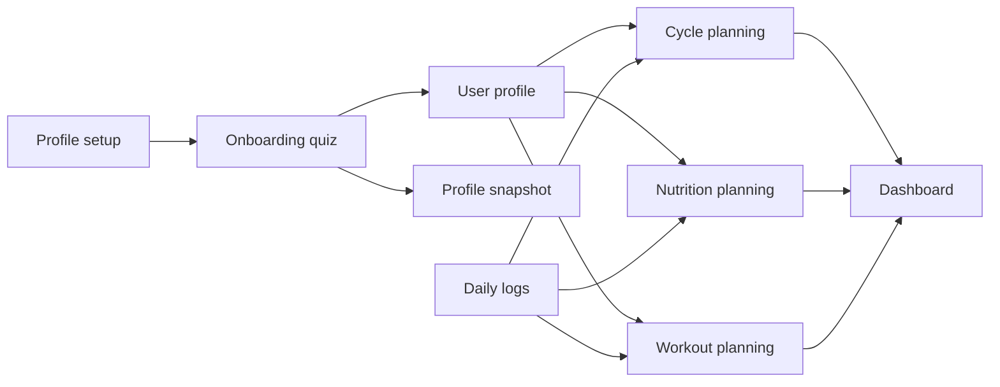

# MuscleCuties

**Fitness that moves with her.**

MuscleCuties is a cycle-aware fitness and nutrition app for women who are active, or working toward becoming more active, while staying attentive to their health and comfort.

Instead of treating cycle tracking, workout planning, nutrition, and recovery as separate concerns, MuscleCuties brings them together. It uses each user's goals, preferences, menstrual-cycle phase, readiness, and recovery to turn personal information into practical guidance for training and meals.

> **Project status:** Functional beta preparing for private testing on iOS and Android.

## What MuscleCuties Does

- Tracks menstrual-cycle phases and provides phase-aware guidance.
- Adapts workout plans to goals, experience, preferences, readiness, and recovery.
- Builds strength, cardio, climbing, yoga, and other supported activities into a structured plan.
- Creates personalized calorie, macro, and micronutrient targets.
- Suggests meals that match dietary preferences and nutritional goals.
- Teaches reusable meal-building structures instead of only prescribing recipes.
- Logs meals, nutrients, workouts, exercise performance, symptoms, and cycle changes.
- Brings daily priorities together on one dashboard.

## Personalization Flow

Onboarding establishes the user's profile and collects the quiz inputs used by the planning features. These include fitness goal, training experience, available training days, preferred activities, session duration, equipment, dietary preferences, current cycle phase, and phase-specific energy or discomfort patterns.



Quiz responses are validated and persisted before updating the user profile. A profile snapshot records the state used by the planners, while subsequent cycle, nutrition, workout, and readiness logs allow recommendations to respond to the user's current context.

## Current Feature Areas

### Cycle

- Manual phase logging and cycle history
- Ordered phase transitions and editable calendar records
- Cycle-phase prediction
- Phase-specific educational guidance
- Cycle-aware dashboard presentation

### Workouts

- Personalized weekly planning
- Phase-, readiness-, recovery-, goal-, and preference-aware activity selection
- Separate activity sessions within the same day
- Strength, duration, distance, pace, heart-rate, power, and cadence logging where appropriate
- Previous-performance context and progressive-overload support
- Workout completion history

### Nutrition

- Personalized calorie and nutrient targets
- Meal and ingredient logging
- Saved and suggested meals
- Dietary-preference filtering
- Macro- and micronutrient breakdowns
- USDA FoodData Central food search
- Serving-size and custom-food support

### Readiness And Recovery

- Daily readiness inputs
- Recovery-aware workout adjustment
- Dashboard readiness and recovery summaries
- Local reminders and cycle-phase notifications

## Technology

- [.NET 10](https://dotnet.microsoft.com/) and .NET MAUI
- C# with nullable reference types enabled
- XAML presentation layer
- MVVM with `CommunityToolkit.Mvvm`
- .NET MAUI Community Toolkit
- Shell navigation
- Microsoft dependency injection
- Entity Framework Core with SQLite
- xUnit, NSubstitute, and Coverlet for automated testing
- USDA FoodData Central API for remote food lookup

## Solution Structure

```text
MuscleCuties.sln
├── src/
│   ├── MuscleCuties.App/        MAUI pages, controls, resources, navigation,
│   │                            platform services, and composition root
│   └── MuscleCuties.Core/       Models, data access, repositories, services,
│                                planning rules, and ViewModels
└── tests/
    └── MuscleCuties.Core.Tests/ Unit and SQLite integration tests
```

The Core project is organized by domain: authentication, cycle, dashboard, health, nutrition, profile, progress, quiz, and workout. UI pages and reusable controls follow the same domain boundaries in the App project.

The primary data flow is:

```text
Page and reusable control
        ↓ binding and commands
ViewModel
        ↓ application workflow
Domain service or planner
        ↓ persistence boundary
Repository
        ↓
Entity Framework Core and SQLite
```

Platform-specific capabilities, such as secure storage, native authentication, notifications, health providers, and image selection, are implemented in `MuscleCuties.App` behind interfaces owned by `MuscleCuties.Core` where appropriate.

## Local Development

### Prerequisites

- macOS with a current Xcode installation for iOS development
- Android SDK and an Android emulator or physical device for Android development
- A .NET SDK compatible with the repository's .NET 10 targets
- The .NET MAUI workload
- Rider, Visual Studio, or another MAUI-capable development environment

Confirm the environment before restoring the solution:

```bash
dotnet --info
dotnet workload list
```

Install the MAUI workload when it is not already available:

```bash
dotnet workload install maui
```

### FoodData Central Configuration

Remote food search requires a USDA FoodData Central API key. Keep it outside source control and expose it to the app as `FDC_API_KEY`:

```bash
export FDC_API_KEY="your-api-key"
```

Do not commit API keys, OAuth client secrets, signing certificates, provisioning profiles, or production credentials.

### Restore And Build

```bash
dotnet restore MuscleCuties.sln
dotnet build src/MuscleCuties.App/MuscleCuties.App.csproj -f net10.0-android
dotnet build src/MuscleCuties.App/MuscleCuties.App.csproj -f net10.0-ios
```

Launch the app through the configured IDE, simulator, emulator, or physical device. Native iOS capabilities require a valid Apple development team, App ID, provisioning profile, and matching entitlements.

### Tests

```bash
dotnet test tests/MuscleCuties.Core.Tests/MuscleCuties.Core.Tests.csproj
```

Run the test suite after changing database configuration, seed data, cycle rules, nutrition calculations, readiness behavior, or workout planning.

## Local Data And Privacy

The current beta is local-first:

- Profiles, quiz responses, cycle records, nutrition logs, workouts, and readiness data are stored in the app's local SQLite database.
- Login state is stored using platform secure storage, with a local preferences fallback.
- Food search terms are sent to the USDA FoodData Central API when remote search is used.
- Feedback is not uploaded automatically. The app opens the user's email composer, and feedback is sent only when the user chooses to send it.
- No advertising, analytics, Firebase, Supabase, or MuscleCuties cloud backend is currently configured.
- Apple Health, Health Connect, and Whoop data access is paused in the current build. The registered health-sync service is disabled and does not read provider data.

This description reflects the current beta implementation, not a permanent production privacy policy. A formal privacy review and user-facing privacy policy are required before public release.

## Beta Limitations

- Accounts and application records are currently device-local and do not synchronize between devices.
- Password handling is suitable only for development and private beta evaluation. Production authentication must use a trusted identity service or a salted, adaptive password-hashing design with a secure backend.
- Apple Health, Health Connect, and Whoop integrations are present as development work but are disabled until native permissions, credentials, token exchange, and privacy behavior are completed and verified.
- Apple Sign-In and Google Sign-In require platform configuration and must be verified with release signing.
- Database creation currently uses the EF Core model and seed routines. A production migration and upgrade strategy must be finalized before public distribution.
- Recommendations remain under active validation and must not be treated as medical guidance.
- Mac Catalyst and Windows are project targets but are not supported private-testing platforms at this stage.

## Private Testing

Private testing is planned through:

- Apple TestFlight for iOS
- Google Play closed testing for Android

Testers should report navigation failures, incorrect recommendations, lost or duplicated records, layout issues, unexpected cycle transitions, and differences between displayed targets and logged totals. Avoid including sensitive health information in a report unless it is necessary and intentionally shared.

## Roadmap To Private Beta

1. Make onboarding, startup, and navigation consistently reliable on iOS and Android.
2. Replace prototype authentication and complete the data-protection review.
3. Validate workout, nutrition, cycle, readiness, and recovery calculations with representative profiles.
4. Establish repeatable database migration and upgrade behavior.
5. Expand automated coverage for critical user journeys and failure cases.
6. Complete release signing, store configuration, accessibility review, and privacy documentation.

## Contributing

MuscleCuties is private, proprietary software. Repository access and contributions are invitation-only.

Before contributing:

1. Discuss the intended change with the maintainer.
2. Keep work within the existing domain and MVVM boundaries.
3. Follow Microsoft C# coding conventions and the established project naming patterns.
4. Add or update tests in proportion to the behavioral risk.
5. Never commit user data, secrets, local databases, provisioning files, or machine-specific settings.

## Health Disclaimer

MuscleCuties provides educational fitness and nutrition guidance. It is not a medical device and does not provide medical diagnosis, treatment, or individualized medical advice. Cycle experiences and health needs vary. Users should consult a qualified healthcare or fitness professional before making decisions related to symptoms, injuries, pregnancy, medical conditions, restrictive diets, or substantial changes in exercise or nutrition.

## Ownership And Contact

**Owner and maintainer:** Denis Petruk  
**Private testing and collaboration:** [deniska.petruk@icloud.com](mailto:deniska.petruk@icloud.com)

Copyright Denis Petruk. All rights reserved. Access and use are permitted only by invitation.
